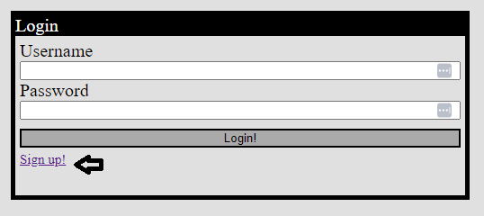

# Tech-Blog

## Description
A blog / forum webpage with a focus on technology. Allows Users to create post and comment on others post. Post / Comments are associated with the users account

## Installation
None. Visit [Tech Blog](https://jatechblog.herokuapp.com/) in order to use the webpage

## Usage

On your first visit to the page, you will need to Sign Up. At the top of the page in the nav bar click `Log in`. Once there, click the `Sign up!` button below the login button as shown in the below image. If this isn't your first visit to the page you can simply Login by inputing your username and password and clicking the `Log in` button.

Once you sign up or log in you will be redirected to your dashboard. Here any of the post you have created will be displayed. If you would like to create a new post, click the `+ New Post` button at the bottom of the page.

If you click on one of your posts listed on the dashboard, then you will be given the option to edit the Title or Content of the post, or delete the post entirely.

If you would like to view other post on the website, from this page you can click on the `Home` button at the top of the webpage. Now that you are logged in you will be able to click on a post in order to view its contents, and comment on on the post.

Finally, when you are done, simply click on the `Log Out` button at the top of the page that replaced the `Log In` button. This will end your current session. Otherwise it will stay active for 24 hours.

## License
NA